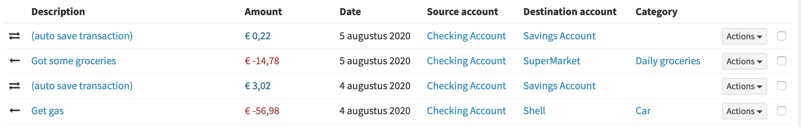
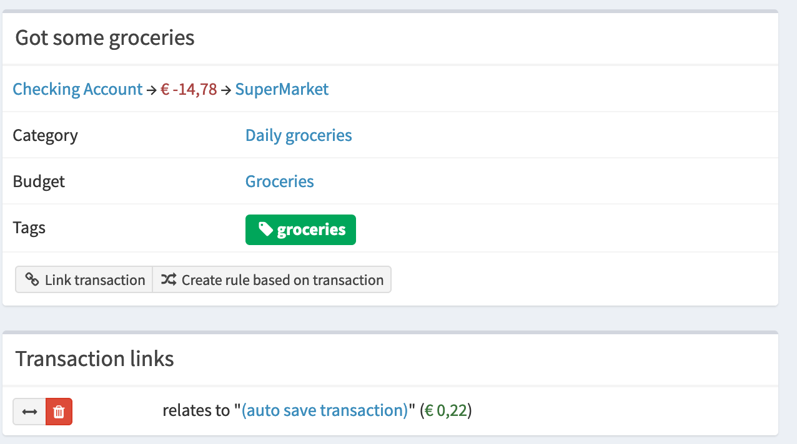

# Basic auto-save / top-up script for Firefly III

## Introduction

These days many banks offer an auto-save function. With each expense the amount is rounded up to € 5,- and the difference is put into your savings account. This can be an easy way to save money.

For example, a fancy cup of coffee (€ 3.45) generates a second transaction of € 1.55 which is saved on your savings account. The total amount is a multiplier of € 5,-.

This little script can automatically create these transactions for you, so you don't have to. You can run it on the command line and it has no external dependencies. This makes it easy to set up and execute. Here's how it works:

## Installation

Just grab `index.php` and save it wherever. You will need php 7.4 with the BCMath, curl and JSON extensions. This is pretty common however so it shouldn't be a problem.

Open the file and edit the Firefly III URL and add a Personal Access Token.

## Usage

To use the script, invoke it as follows:

```shell script
php autosave.php --account=1 --destination=2 --amount=2.5 --days=10 --dry-run 
```

Here's what each argument is for:

### account

This is the ID of your main checking account.

### destination

This is the savings account where the money is saved on.

### amount

This is the amount that you've agreed with your bank to round towards. Most people round up to `1` EUR, but you could also set it to `2.5` or even `5`.

### days

If you plan to run this script regularly, set this argument to a limited number of days, so you don't download too many transactions.

### dry-run

So you can test if it works expected.

## Usage examples:

Basic dry run to see what happens

```shell script
php autosave.php --account=1 --destination=2 --amount=5 --days=8 --dry-run 
```

Don't limit the number of days, and don't do a dry run.

```shell script
php autosave.php --account=1 --destination=2 --amount=5 
```

Run this every week, my bank rounds up to 5 euro's, from asset account 17 to savings account 12. Not a dry run! 

```shell script
php autosave.php --account=17 --destination=12 --amount=5 --days=8 
```

## Example output:

```shell script
$ php autosave.php --account=1 --destination=2 --amount=5

Not defining the number of days to go back will not improve performance.
Start of script. Welcome!
Downloading info on account #1...
Downloading info on account #2...
Both accounts are valid asset accounts.
Downloading transactions for account #1 "Checking Account"...
Found 151 transactions.
Split transactions are not supported, so transaction #2 will be skipped.
For transaction #96 ("Went for groceries") with amount EUR 5.89, have created auto-save transaction #253 with amount EUR 4.11, making the total EUR 10.00.
...
```

## Example results





## FAQ

### Can it also do auto-save for split transactions?

Nope.

### Will it create new auto-save transactions if I run it twice?

No. If an auto-save transaction exists already, it won't be recreated.

### Can I use liability accounts to save on?

No. Both accounts must be asset accounts.

### Is this script supported in any way?

No. Use at your own risk. This script can show you how powerful the API can be. On your own head be it.

### What's the minimum version you need?

This script requires Firefly III v5.4.0 minimum.